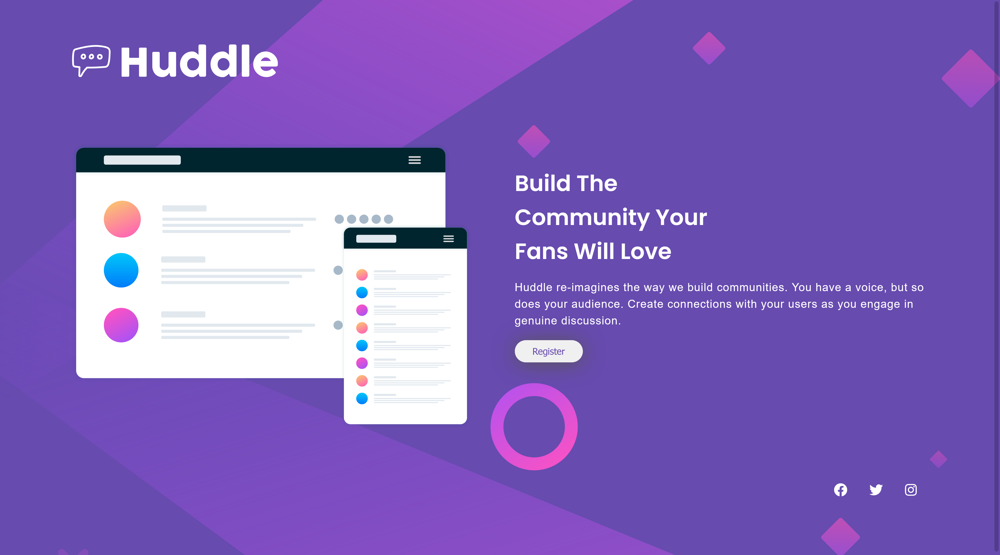

# Frontend Mentor - Huddle landing page with single introductory section solution

This is a solution to the [Huddle landing page with single introductory section challenge on Frontend Mentor](https://www.frontendmentor.io/challenges/huddle-landing-page-with-a-single-introductory-section-B_2Wvxgi0). Frontend Mentor challenges help you improve your coding skills by building realistic projects. 

## Table of contents

- [Overview](#overview)
  - [The challenge](#the-challenge)
  - [Screenshot](#screenshot)
  - [Links](#links)
- [My process](#my-process)
  - [Built with](#built-with)
  - [Useful resources](#useful-resources)
- [Author](#author)

## Overview

### The challenge

Users should be able to:

- View the optimal layout for the component depending on their device's screen size

### Screenshot
- Desktop 1440px
  
  

- Mobile 375px
  
  

### Links

- Live Site URL: [Huddle Landing Page](https://sunil-sharma-999.github.io/Huddle-Landing-Page/)

## My process

### Built with

- HTML5
- CSS
- Mobile-first workflow

### Useful resources

- [MDN CSS](https://developer.mozilla.org/en-US/docs/Web/CSS) - This website always helps me with fundamental concepts.
- [Stackoverflow](https://stackoverflow.com/) - When i can't find answer to any questions stackoverflow is always there to help.

## Author

- Website - [Sunil Sharma](https://github.com/sunil-sharma-999/)
- Frontend Mentor - [@sunil-sharma-999](https://www.frontendmentor.io/profile/sunil-sharma-999)
- instagram - [@sunil999](https://www.instagram.com/sunil.sharma.9/)

